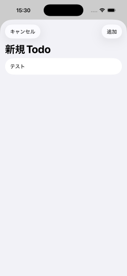
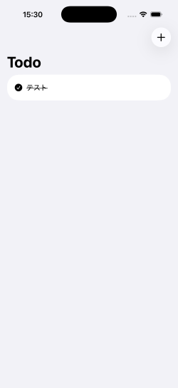

# 📝 Todo App（SwiftUI × CoreData × MVVM）

## 📱 Overview
SwiftUIとCoreDataを用いて作成したTodoアプリです。  
タスクの追加・削除・完了管理を行い、データは永続化されます。

---

## 🚀 Features
- タスクの追加
- タスクの削除（スワイプ）
- タスクの完了チェック（即時反映）
- データの永続化（アプリ再起動後も保持）
- シンプルなUIで直感的操作

---

## 🛠️ Tech Stack
- SwiftUI
- CoreData
- MVVM

---

## 📸 Screenshots

  
  
  

---

## 📌 Architecture

MVVMアーキテクチャを採用し、
View / ViewModel / Model を分離しています。

ViewModelで状態管理を行い、CoreDataとのデータ連携を担当しています。

---

## 💡 Points
- CoreDataとSwiftUIの状態管理の連携を実装
- `@ObservedObject` を使用し、データ変更時に即座にUIへ反映
- ListとButtonのタップ競合を `.buttonStyle(.plain)` で解消
- MVVM構成によりViewとロジックを分離
- ListとButtonのタップ競合の解消に苦労し、UI挙動を改善

---

## 🔧 Future Improvements
- タスク編集機能
- 並び替え機能
- 検索機能
- UI改善（ダークモード対応など）

---

## 🧑‍💻 Author
GitHub: https://github.com/taka-sakamoto

